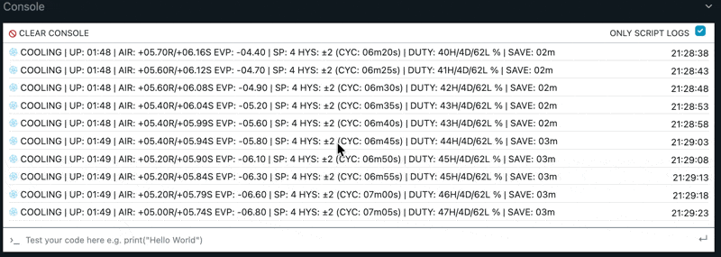

# Shelly Fridge Controller

[](https://github.com/chiptoma/shelly-fridge-controller/actions/workflows/ci.yml)
[](https://github.com/chiptoma/shelly-fridge-controller/actions/workflows/security.yml)
[](https://github.com/chiptoma/shelly-fridge-controller)
[](LICENSE)
[](https://github.com/chiptoma/shelly-fridge-controller/releases/latest)

**Stop defrosting your fridge manually. Get precise temperature control.**

A smart controller that monitors your evaporator coil, triggers defrost automatically, and replaces your 1-5 dial with actual °C control.



---

## The Problem

Every fridge has this cycle:

```
Compressor runs → Evaporator gets cold → Moisture freezes on coil → Ice builds up
                                                                          ↓
Airflow blocked ← Ice layer thickens ← More moisture freezes ← Coil stays cold
       ↓
Compressor runs forever trying to cool air that can't circulate
```

**The thermostat can't see this happening.** It only measures air temperature - by the time the air warms up, you've got an ice block.

My drinks fridge needed manual defrost every 10 days. I'd have to turn it off and wait for the ice to melt. Plus, the 1-5 rotary thermostat gave me no real control over the actual temperature.

---

## The Solution

**Put a sensor on the evaporator coil.** Now you can see ice forming.

```
Normal operation:    Evaporator at -8°C to -12°C ✓
Ice forming:         Evaporator drops below -16°C ⚠️
                              ↓
               Controller stops cooling
                              ↓
               Evaporator warms to -5°C
                              ↓
               Hold for 5 minutes (ice melts)
                              ↓
               Resume normal cooling ✓
```

No more ice blocks. No more manual defrost. The controller catches it early, every time.

---

## Features

### Smart Defrost

Two systems ensure ice never builds up:

| System | Trigger | Action |
|--------|---------|--------|
| **Dynamic** | Evaporator hits -16°C | Stop cooling → warm to -5°C → hold 5 min |
| **Scheduled** | Daily at 1 AM | Backup defrost window (up to 1 hour) |

Dynamic defrost is the workhorse - it catches ice as it forms. Scheduled defrost is the safety net.

### Precise Temperature Control

Replace your vague 1-5 dial with actual degrees:

- **Set exact target**: 4.0°C, 3.5°C, whatever you want
- **Smoothed readings**: EMA filter eliminates noise and door-open spikes
- **Adaptive hysteresis**: Auto-adjusts to achieve 10-20 min cycles (optimal for compressor)

### Compressor Protection

Every decision passes through safety checks:

| Guard | Purpose |
|-------|---------|
| **Min Run** (3 min) | Prevents incomplete cooling cycles |
| **Min Off** (5 min) | Lets refrigerant pressures equalize |
| **Max Run** (2 hr) | Forces stop if something's wrong |
| **Freeze Cut** (0.5°C) | Emergency stop if air too cold |

### Fault Detection

| Fault | Detection | Response |
|-------|-----------|----------|
| **Relay Weld** | Temp drops while "off" | FATAL alarm |
| **Locked Rotor** | Power > 400W | FATAL alarm |
| **Ghost Run** | Power < 10W while "on" | Warning → FATAL |
| **Sensor Fail** | Null readings | Enters Limp Mode |

### Limp Mode (Never Gives Up)

When sensors fail, the controller keeps your food cold anyway:

```
Blind cycling: 30 min ON → 15 min OFF → repeat (66% duty)
```

Auto-recovers when sensors come back.

---

## Quick Start

```bash
git clone https://github.com/chiptoma/shelly-fridge-controller.git
cd shelly-fridge-controller
npm install

cp .env.example .env
# Edit .env: SHELLY_IP=192.168.1.xxx

npm run deploy:monitor
```

---

## Hardware

| Component | Purpose |
|-----------|---------|
| **Shelly Plus 1 or 1PM** | Controller with power monitoring |
| **Shelly Plus Add-On** | Connects temperature sensors |
| **DS18B20 (x2)** | Air sensor + evaporator sensor |

### Sensor Placement

| Sensor | Location | Why |
|--------|----------|-----|
| **Air** (ID: 101) | Middle of fridge, away from walls | Measures actual food temperature |
| **Evaporator** (ID: 100) | Clamped to evaporator coil | **Detects ice formation** - this is the critical one |

### Wiring

```
Mains                    Shelly Plus 1PM                   Compressor
─────                    ───────────────                   ──────────

                      ┌─────────────────┐
L (Live) ─────────────┤ L           O ├─────────────────► L (Live)
                      │                 │
N (Neutral) ──────────┤ N    [Add-On]  │
      │               │     100: Evap  │◄── DS18B20 on evaporator coil
      │               │     101: Air   │◄── DS18B20 in fridge air
      │               └─────────────────┘
      │
      └────────────────────────────────────────────────► N (Neutral)
```

---

## MQTT

> **Security Note:** MQTT communication has no authentication by design. This is standard for local IoT deployments where the MQTT broker is on a trusted home network. For internet-exposed setups, configure TLS and authentication on your MQTT broker.

### Status (every 5s to `fridge/status`)

```json
{
  "tAirRaw": 4.3,
  "tAirSmt": 4.2,
  "tEvap": -8.5,
  "tDev": 32.1,
  "status": "COOLING",
  "reason": "TEMP",
  "alarm": "NONE",
  "relayOn": 1,
  "dutyHr": 45.2,
  "dutyDay": 42.8,
  "dutyLife": 41.5,
  "hoursLife": 1247,
  "hyst": 1.2,
  "avgOnSec": 720,
  "avgOffSec": 480,
  "defrostOn": 0,
  "doorOpen": 0,
  "turboOn": 0,
  "health": 0.25,
  "watts": 85
}
```

| Field | Description |
|-------|-------------|
| `tAirRaw` | Raw air temperature (°C) |
| `tAirSmt` | Smoothed air temperature (°C) |
| `tEvap` | Evaporator temperature (°C) |
| `tDev` | Shelly device temperature (°C) |
| `status` | Current state (IDLE, COOLING, DEFROST, LIMP, etc.) |
| `reason` | Why in this state (TEMP, TIMER, PROTECT, etc.) |
| `alarm` | Active alarm (NONE, TEMP, SENSOR, WELD, etc.) |
| `relayOn` | Compressor running (0/1) |
| `dutyHr` | Duty cycle this hour (%) |
| `dutyDay` | Average duty cycle 24h (%) |
| `dutyLife` | Lifetime duty cycle (%) |
| `hoursLife` | Total compressor run hours |
| `hyst` | Current hysteresis band (°C) |
| `avgOnSec` | Average ON cycle length (seconds) |
| `avgOffSec` | Average OFF cycle length (seconds) |
| `defrostOn` | Defrost active (0/1) |
| `doorOpen` | Door open detected (0/1) |
| `turboOn` | Turbo mode active (0/1) |
| `health` | Cooling efficiency (°C/min) |
| `watts` | Current power draw (W, null if no PM) |

### Commands (`fridge/command`)

```json
{"cmd": "setpoint", "value": 3.5}
{"cmd": "turbo_on"}
{"cmd": "turbo_off"}
{"cmd": "reset_alarms"}
```

### Home Assistant

```yaml
sensor:
  - platform: mqtt
    name: "Fridge Temperature"
    state_topic: "fridge/status"
    value_template: "{{ value_json.tAirSmt }}"
    unit_of_measurement: "°C"

  - platform: mqtt
    name: "Evaporator Temperature"
    state_topic: "fridge/status"
    value_template: "{{ value_json.tEvap }}"
    unit_of_measurement: "°C"

binary_sensor:
  - platform: mqtt
    name: "Fridge Defrost Active"
    state_topic: "fridge/status"
    value_template: "{{ value_json.defrostOn }}"
    payload_on: 1
    payload_off: 0
```

---

## Configuration

| Setting | Default | Description |
|---------|---------|-------------|
| `ctl_targetDeg` | 4.0°C | Target temperature |
| `defr_dynTrigDeg` | -16°C | Evap temp that triggers defrost |
| `defr_dynEndDeg` | -5°C | Evap temp that ends defrost |
| `defr_schedHour` | 1 | Hour for scheduled defrost (1 AM) |

**50+ settings available** - See [CONFIGURATION.md](docs/CONFIGURATION.md)

---

## Commands

| Command | Description |
|---------|-------------|
| `npm run deploy` | Build and deploy |
| `npm run deploy:monitor` | Deploy + live logs |
| `npm run shelly:status` | Device status |
| `npm run shelly:monitor` | Live debug output |
| `npm test` | Run tests |

---

## Documentation

| Doc | Description |
|-----|-------------|
| **[ALGORITHM.md](docs/ALGORITHM.md)** | Control loop, defrost logic, state machines |
| **[CONFIGURATION.md](docs/CONFIGURATION.md)** | All 50+ settings |
| **[DEPLOYMENT.md](docs/DEPLOYMENT.md)** | Build and deploy tools |
| **[TESTING.md](docs/TESTING.md)** | 849 tests |

---

## Specs

| | |
|---|---|
| **Runtime** | Shelly mJS (ES5) |
| **Memory** | ~25KB heap |
| **Bundle** | <32KB |
| **Tests** | 849 |

---

## License

**PolyForm Noncommercial 1.0.0** - Free for personal use.

See [LICENSE](LICENSE) for full terms.
