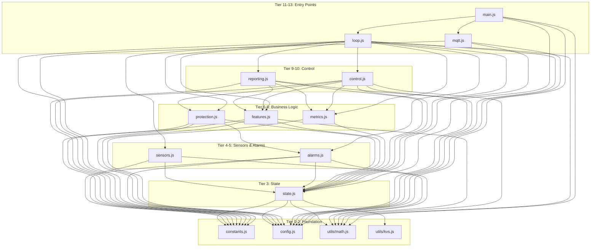
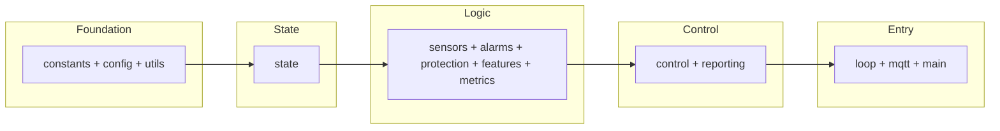

# Module Dependencies

This document describes the dependency structure of the Shelly Fridge Controller codebase.

## Dependency Tiers

Modules are organized into tiers based on their dependencies. Later tiers may depend on earlier tiers, but not vice versa.

| Tier | Module | Dependencies |
|------|--------|--------------|
| 0 | constants.js | None |
| 1 | config.js | None |
| 2 | utils/math.js | None |
| 2 | utils/kvs.js | None |
| 3 | state.js | constants, config, utils/kvs, utils/math |
| 4 | sensors.js | constants, state, utils/math |
| 5 | alarms.js | constants, state, config, utils/math |
| 6 | protection.js | constants, state, config, alarms |
| 7 | features.js | constants, state, config, utils/math |
| 8 | metrics.js | state, config |
| 9 | reporting.js | constants, state, config, metrics, features |
| 10 | control.js | constants, state, config, protection, features, metrics, utils/math |
| 11 | loop.js | All modules |
| 12 | mqtt.js | constants, config, state |
| 13 | main.js | config, state, loop, mqtt, utils/math |

## Dependency Graph

## Simplified View

## Import Rules

1. **No Circular Dependencies**: Module A cannot import from B if B imports from A
2. **Tier Order**: Higher tiers may import from lower tiers, not vice versa
3. **Utility Exception**: `utils/math.js` and `utils/kvs.js` may be imported anywhere
4. **State Singletons**: `S` (persisted) and `V` (volatile) are imported from `state.js`
5. **Config Singleton**: `C` is imported from `config.js`

## Bundle Order

The build tool (`tools/concat.cjs`) concatenates files in tier order. This ensures:

- Dependencies are defined before use
- No forward references
- ES module imports can be stripped safely

See `FILE_ORDER` in `tools/concat.cjs` for the exact concatenation sequence.
